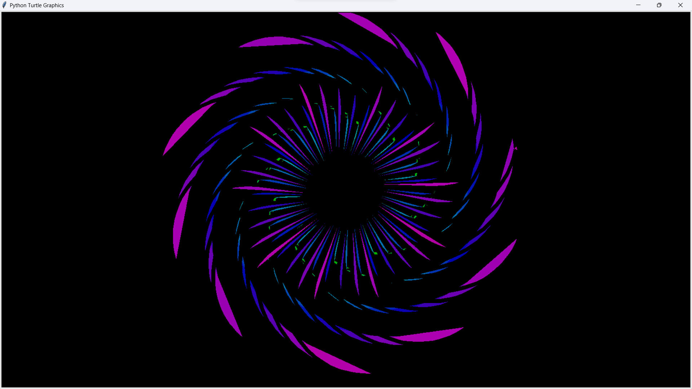

# Turtle Graphic
Ini adalah repository yang berisi proyek sederhana yang menggunakan pustaka turtle dalam Python untuk membuat berbagai bentuk dan pola grafis.

## Persyaratan

Pastikan Anda memiliki Python terinstal di sistem Anda. Proyek ini menggunakan pustaka turtle, yang sudah tersedia secara bawaan dalam Python.

## The Project 📸

### 1. Colorful.py

### 2. Flower1.py

### 3. Heart.py

### 4. RoseFlower.py

### 5. Bouquet.py

### 6. Cinnamonroll.py

### 7. Snoopy.py

### 8. Stitch.py

### 9. SakuraTree.py

### 10. a.py


## Instalasi 🛠

1. Clone repositori ini:
```sh
git clone https://github.com/Widyasmaraafif/TurtleGraphic.git
```
2. Pindah ke direktori proyek:
```sh
cd turtle-graphic
```
3. Jalankan skrip utama:
```sh
python [NamaFile].py
```
## Penggunaan

- Jalankan [NamaFile].py untuk melihat gambar yang dihasilkan.

- Anda dapat mengedit skrip untuk menggambar pola yang berbeda.

- Gunakan perintah turtle.speed() untuk mengatur kecepatan gambar.
